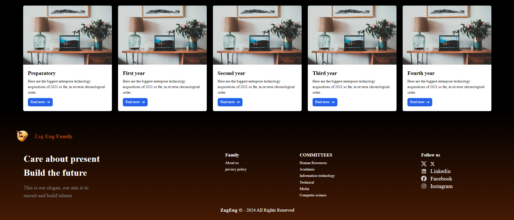

# Zag Eng Family

Zag Eng Family is a web-based platform that allows users to search and manage data from various providers. Designed to provide students with a convenient and efficient solution, it offers an easy-to-use interface, a login system, and personalized data management for registered users.

## Table of Contents

- [Features](#features)
- [Technologies](#technologies)
- [Installation](#installation)
- [Screenshots](#screenshots)
- [Usage](#usage)
- [Contributing](#contributing)

## Features

- **Search and Manage Data**: Users can search for and manage data from multiple providers.
- **User Login System**: Secure login for students with personalized dashboards.
- **Data Management**: Registered users can save, organize, and access their data efficiently.
- **Responsive Design**: The platform is fully responsive and works on all devices.

## Technologies

- HTML
- CSS
- JavaScript
- React
- Vercel (for deployment)
- Excel sheet page

## Installation

To run this project locally:

1. Clone the repository:

```
git clone https://github.com/your-username/zag-eng-family.git
```

2.Install the dependencies:
``` 
npm install
```

3.Start the development server:
```
npm run dev
```

## Screenshots

Here are some screenshots of the Zag Eng Family platform:

### Home Page


### Partners


### Team Structure


### Form


### Materials



## Usage

To start using the Zag Eng Family platform:

1. **LogIn**: Create a new account or log in using an existing one.
2. **Search for Data**: Use the search functionality to find relevant data from various providers.
3. **Manage Data**: Once logged in, users can save, edit, and organize their data through the personalized dashboard.
4. **Explore Pages**: Navigate through the platform’s various pages for additional information, support, and resources.

The platform is designed to work seamlessly on mobile, tablet, and desktop devices.

## Contributing

Contributions are welcome! If you'd like to contribute to this project:

1. Fork the repository.
2. Create a new branch:

   ```
   git checkout -b feature/new-feature
```
3. Make your changes and commit them:
```
git commit -m 'Add a new feature'
```
4. Push your branch:
```
git push origin feature/new-feature
```
5. Open a pull request on GitHub.